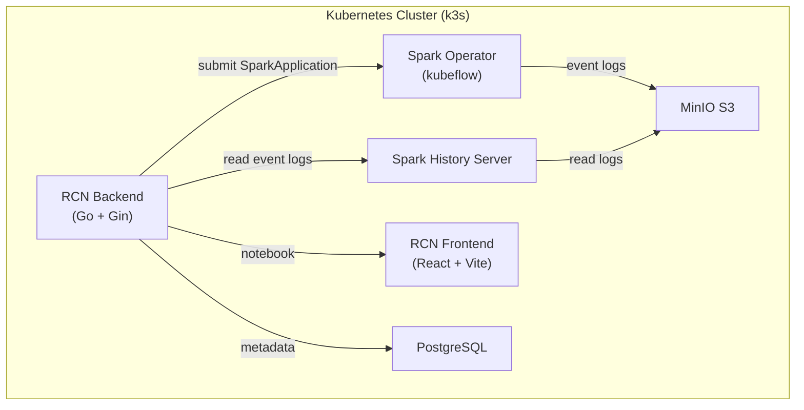

# 📋 RCN Project Backlog

> **Project:** Spark Enterprise All-in-One Platform
> **Repo:** github.com/thinh661/rcn
> **PO:** Công Thịnh
> **PM/Tech Lead:** Thư ký Kim
> **Senior Dev:** Antigravity CLI (Google DeepMind)

---

## 🎯 Vision

Xây dựng RCN từ Spark Notebook platform thành Spark Enterprise All-in-One Platform tương đương Databricks, Amazon EMR Studio, Google Dataproc — nhưng open-source, Kubernetes-native, và deploy nội bộ.

---

## 🗺️ Roadmap

| Phase | Mục tiêu | Thời gian | Trạng thái |
|-------|----------|-----------|:----------:|
| **Phase 1** | Nền tảng mở rộng | 2-3 tuần | 🟢 Done |
| **Phase 2** | Batch & Scheduling | 3-4 tuần | 🟢 Done |
| **Phase 3** | Enterprise Features | 4-5 tuần | 🟢 Done |
| **Phase 4** | Monitoring & Operations | 3-4 tuần | 🟢 Done |

---

## 🚀 Phase 1: Nền tảng mở rộng

**Mục tiêu:** RCN chạy ổn định, mở rộng được các tính năng Spark chuẩn

| # | Feature | Type | Trạng thái | Assigned |
|---|---------|------|:----------:|----------|
| 1.1 | Spark Operator + SparkApplication CRD | 🏗️ Kiến trúc | 🟢 Done | agy |
| 1.2 | Spark History Server (MinIO event log) | ⚡ Feature | 🟢 Done | agy |
| 1.3 | Batch Jobs API (submit/list/stop) | ⚡ Feature | 🟢 Done | agy |
| 1.4 | Resource Presets mở rộng | ⚡ Feature | 🟢 Done | agy |
| 1.5 | Iceberg catalog integration | ⚡ Feature | 🟢 Done | agy |
| 1.6 | Fix CORS security | 🐛 Bug | 🟢 Done | agy |
| 1.7 | CI/CD pipeline (GitHub Actions) | 🔧 Infra | 🟢 Done | agy |

---

## 🚀 Phase 2: Batch & Scheduling

**Mục tiêu:** Batch job UI, scheduling, templates, monitoring

| # | Feature | Type | Trạng thái | Assigned |
|---|---------|------|:----------:|----------|
| 2.1 | Frontend Batch Jobs UI | ⚡ Feature | 🟢 Done | agy |
| 2.2 | Scheduled Jobs API (Cron scheduling) | ⚡ Feature | 🟢 Done | agy |
| 2.3 | Job Templates | ⚡ Feature | 🟢 Done | agy |
| 2.4 | Job Notifications (Webhook) | ⚡ Feature | 🟢 Done | agy |
| 2.5 | Batch Dashboard / Monitoring | ⚡ Feature | 🔵 Backlog | - |

---

## 🚀 Phase 3: Enterprise Features

**Mục tiêu:** Multi-tenancy, audit, security, governance

| # | Feature | Type | Trạng thái | Assigned |
|---|---------|------|:----------:|----------|
| 3.1 | Multi-tenancy & RBAC (roles: admin/editor/viewer) | 🏗️ Kiến trúc | 🟢 Done | agy |
| 3.2 | Audit Logging (API action history) | ⚡ Feature | 🟢 Done | agy |
| 3.3 | Git Integration (notebook versioning) | ⚡ Feature | 🟢 Done | agy |
| 3.4 | Spark Connect (gRPC remote SparkSession) | ⚡ Feature | 🟢 Done | agy |
| 3.5 | Secret Management (encrypted credentials store) | 🏗️ Kiến trúc | 🟢 Done | agy |
| 3.6 | Resource Usage & Cost Tracking | ⚡ Feature | 🟢 Done | agy |

---

## 🚀 Phase 4: Monitoring & Operations

**Mục tiêu:** Prometheus metrics, health checks, monitoring dashboard, alerts

| # | Feature | Type | Trạng thái | Assigned |
|---|---------|------|:----------:|----------|
| 4.1 | Prometheus Metrics (API + runtime) | ⚡ Backend | 🟢 Done | main |
| 4.2 | Health Checks + System Health API | ⚡ Backend | 🟢 Done | main |
| 4.3 | Grafana Dashboard templates | 📦 Config | 🟢 Done | main |
| 4.4 | Log Aggregation (Loki config) | 📦 Config | 🟢 Done | main |
| 4.5 | Alert Rules (Prometheus) | ⚡ Config | 🟢 Done | main |
| 4.6 | System Admin Dashboard (Frontend) | ⚡ Frontend | 🟢 Done | agy |
| 2.5 | Batch Dashboard (Frontend) | ⚡ Frontend | 🟢 Done | agy |

---

## 🚀 Phase 5: Enterprise Plus — Đang làm

**Mục tiêu:** RCN tiến gần hơn tới Databricks-level platform

| # | Feature | Type | Trạng thái | Assigned |
|---|---------|------|:----------:|----------|
| 5.1 | Data Catalog (backend) | ⚡ Backend | 🟢 Done | main |
| 5.1 | Data Catalog (migration + routes) | ⚡ Backend | 🟢 Done | main |
| 5.2 | Workflows (DAG Jobs) — backend | ⚡ Backend | 🟡 In Progress | agy ⚡ |
| 5.3 | MLflow Integration | ⚡ Backend | 🔵 Backlog | main |
| 5.4 | Notebook Scheduler — backend | ⚡ Backend | 🟡 In Progress | agy ⚡ |
| 5.5 | AI Assistant — frontend + backend | ⚡ Feature | 🟢 Done | agy + main |
| 5.6 | Billing Dashboard — frontend | ⚡ Frontend | 🟢 Done | agy |
| 5.7 | Team/Org Tree — backend | 🏗️ Backend | 🟡 In Progress | agy ⚡ |
| 5.8 | API Docs (Swagger) | 📦 Tooling | 🔵 Backlog | main |
| 5.9 | Unit + Integration Tests | 🔧 Quality | 🔵 Backlog | agy |
| 5.10 | Delta Lake / Delta Sharing | ⚡ Config | 🔵 Backlog | agy |

---

## 📐 Kiến trúc Phase 1



---

## 📐 Iceberg Architecture (Phase 1.5)

```
Spark Application
    │
    ├── Iceberg Catalog ──► MinIO (warehouse/)
    │       └── hadoop catalog (no Hive needed for now)
    │
    └── Event Log ──► MinIO (event-logs/)
                      └── Spark History Server reads from here
```

---

## 🔄 Workflow

```
Sếp (PO) → Yêu cầu
    → Thư ký Kim (PM) phân loại, phân tích
    → Tạo Task trong Backlog
    → Giao agy (Senior Dev) thực hiện
    → Thư ký Kim review kết quả
    → Báo cáo sếp
```

---

## 📊 Trạng thái Legend

| Symbol | Ý nghĩa |
|:------:|---------|
| 🔵 Backlog | Chưa bắt đầu |
| 🟡 In Progress | Đang làm |
| 🟢 Done | Hoàn thành |
| 🔴 Blocked | Bị chặn |
| 🟣 Review | Đang review |
